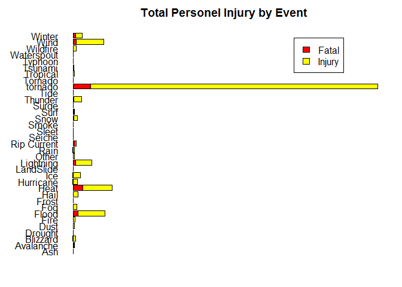

Title: United States Storm Data Analysis
========================================

Synopsis
--------

Immediately after the title, there should be a synopsis which describes
and summarizes your analysis in at most 10 complete sentences.

Data Processing
---------------

In order to accomplish our analysis we will need to pull in and clean
any releveant data. The data is stored in a bz2 file so we read is in
with a csv reader and then do a transformation to group all of our
events together so we can perform proper analysis on them. Any event
sleft over are classifired in a "Other" group

    options(scipen=999)
    url <- "https://d396qusza40orc.cloudfront.net/repdata%2Fdata%2FStormData.csv.bz2"
    download.file(url,"StormData.csv.bz2",method="curl")
    rawData <- read.csv("StormData.csv.bz2")
    events <- data.frame(unique(rawData$EVTYPE))
    colnames(events)<-c("Event")

    grp_func <- function(x,y){
      output_list <- c()
      for (i in x){
        output <- "Other"
        for (j in 1:nrow(y)){
          results = grepl(paste("+",y[j,1],"+",sep=''),i,ignore.case = TRUE)*1
          if (results == 1){
            output <- y[j,2]
          }
        }
        output_list <- c(output_list,output)
      }
      return(output_list)
    }

    groupList<-cbind(
      c('Dry','Freeze','Warm','Fld','LandSlide','Rip Current','Funnel','Rain','Fire','Wintr','Winter','Wildfire','Waterspout','Ice','Ash','Tsunami','Tropical','Tide','Surge','Sleet','Seiche','RipCurrent','Lightning','Typhoon','Hurricane','Wind','Surf','Snow','Hail','FunnelCloud','Frost','Cold','Heat','Drought','Smoke','Fog','Dust','Debris','Flood','Floood','Blizzard','Avalanche','tornado','Thunder'),
      c('Drought','Ice','Heat','Flood','LandSlide','Rip Current','Tornado','Rain','Fire','Winter','Winter','Wildfire','Waterspout','Ice','Ash','Tsunami','Tropical','Tide','Surge','Sleet','Seiche','RipCurrent','Lightning','Typhoon','Hurricane','Wind','Surf','Snow','Hail','FunnelCloud','Frost','Winter','Heat','Drought','Smoke','Fog','Dust','Debris','Flood','Flood','Blizzard','Avalanche','tornado','Thunder')
    )

    events$groupName<-grp_func(events$Event,groupList)

    fullData <- merge(x=rawData,y=events, by.x="EVTYPE", by.y="Event")

Next we need to subset our data to look at helath and economic impacts
seperatly. In addition we need to aggregate our data so we can make some
high level comparisons. Economic data will require that we trandform
K/M/B into there respective numeric amounts.

    #create subsets for health and economic impact
    healthImpact <- subset(fullData,select=c("groupName","FATALITIES","INJURIES"))
    econImpact <- subset(fullData,select=c("groupName","PROPDMG","PROPDMGEXP","CROPDMG","CROPDMGEXP")) 

    #Aggregate health by event
    healthMean <- aggregate(list(healthImpact$FATALITIES,healthImpact$INJURIES), by =list(healthImpact$groupName), FUN = mean,na.rm = TRUE)
    healthSum <- aggregate(list(healthImpact$FATALITIES,healthImpact$INJURIES), by =list(healthImpact$groupName), FUN = sum,na.rm = TRUE)
    healthAgg<-merge(healthMean,healthSum,by = "Group.1")
    colnames(healthAgg)<-c("Event","meanFatalites","meanInjuries",'sumFatalites','sumInjuries')

    #Create health Table for stacked bar
    healthMeanTable <- t(healthAgg[,2:3])
    healthSumTable <- t(healthAgg[,4:5])
    colnames(healthMeanTable) <- healthAgg$Event
    colnames(healthSumTable) <- healthAgg$Event

    #create multipliers to handle K/M/B
    econImpact[ grep("k", econImpact$PROPDMGEXP, ignore.case=TRUE),c("propMultiplier")] <- "1000"
    econImpact[ grep("m", econImpact$PROPDMGEXP, ignore.case=TRUE),c("propMultiplier")] <- "1000000"
    econImpact[ grep("b", econImpact$PROPDMGEXP, ignore.case=TRUE),c("propMultiplier")] <- "1000000000"
    econImpact$propMultiplier[is.na(econImpact$propMultiplier)] <- 1
    econImpact$TotalPropDamage <- as.numeric(econImpact$PROPDMG) * as.numeric(econImpact$propMultiplier )

    econImpact[ grep("k", econImpact$CROPDMGEXP, ignore.case=TRUE),c("cropMultiplier")] <- "1000"
    econImpact[ grep("m", econImpact$CROPDMGEXP, ignore.case=TRUE),c("cropMultiplier")] <- "1000000"
    econImpact[ grep("b", econImpact$CROPDMGEXP, ignore.case=TRUE),c("cropMultiplier")] <- "1000000000"
    econImpact$cropMultiplier[is.na(econImpact$cropMultiplier)] <- 1
    econImpact$TotalCropDamage <- as.numeric(econImpact$CROPDMG) * as.numeric(econImpact$cropMultiplier )

    #Aggregate Econ by event

    econMean <- aggregate(list(econImpact$TotalCropDamage,econImpact$TotalPropDamage), by =list(econImpact$groupName), FUN = mean,na.rm = TRUE)
    econSum <- aggregate(list(econImpact$TotalCropDamage,econImpact$TotalPropDamage), by =list(econImpact$groupName), FUN = sum,na.rm = TRUE)
    econAgg<-merge(econMean,econSum,by = "Group.1")
    colnames(econAgg)<-c("Event","meanCropDmg","meanPropDmg",'sumCropDmg','sumPropDmg')

    #Create Econ Table for stacked bar
    econMeanTable <- t(econAgg[,2:3])
    econSumTable <- t(econAgg[,4:5])
    colnames(econMeanTable) <- econAgg$Event
    colnames(econSumTable) <- econAgg$Event

Results
-------

1.  Make a time series plot (i.e. type = "l") of the 5-minute
    interval (x-axis) and the average number of steps taken, averaged
    across all days (y-axis) This code groups steps into 5 minute
    intervals and calculates the average and then plots it on a line
    plot

<!-- -->

    healthAgg

    ##          Event meanFatalites meanInjuries sumFatalites sumInjuries
    ## 1          Ash 0.00000000000 0.0000000000            0           0
    ## 2    Avalanche 0.57881136951 0.4418604651          224         171
    ## 3     Blizzard 0.03680758017 0.2933673469          101         805
    ## 4      Drought 0.00321543408 0.0167917113            9          47
    ## 5         Dust 0.04074702886 0.8200339559           24         483
    ## 6         Fire 0.01020408163 0.4741496599           15         697
    ## 7        Flood 0.01803255846 0.1008220896         1553        8683
    ## 8          Fog 0.04301646309 0.5719596389           81        1077
    ## 9        Frost 0.00071225071 0.0021367521            1           3
    ## 10        Hail 0.00006889187 0.0050497744           20        1466
    ## 11        Heat 1.07234617985 3.1196754564         3172        9228
    ## 12   Hurricane 0.46341463415 4.6271777003          133        1328
    ## 13         Ice 0.04462659381 0.9799635701           98        2152
    ## 14   LandSlide 0.06403940887 0.0870279146           39          53
    ## 15   Lightning 0.05183023536 0.3318530737          817        5231
    ## 16       Other 0.10771470160 0.4643377001           74         319
    ## 17        Rain 0.00882037755 0.0249773308          107         303
    ## 18 Rip Current 0.73901808786 0.6834625323          572         529
    ## 19      Seiche 0.00000000000 0.0000000000            0           0
    ## 20       Sleet 0.02173913043 0.0000000000            2           0
    ## 21       Smoke 0.00000000000 0.0000000000            0           0
    ## 22        Snow 0.00865678398 0.0658594546          153        1164
    ## 23        Surf 0.15586854460 0.2309859155          166         246
    ## 24       Surge 0.05839416058 0.1046228710           24          43
    ## 25     Thunder 0.00193462430 0.0226314541          212        2480
    ## 26        Tide 0.00000000000 0.0000000000            0           0
    ## 27     tornado 0.09326194399 1.5058813839         5661       91407
    ## 28     Tornado 0.00000000000 0.0004297994            0           3
    ## 29    Tropical 0.08718626156 0.5059445178           66         383
    ## 30     Tsunami 1.65000000000 6.4500000000           33         129
    ## 31     Typhoon 0.00000000000 0.4545454545            0           5
    ## 32  Waterspout 0.00078003120 0.0075403016            3          29
    ## 33    Wildfire 0.02708559047 0.3289996389           75         911
    ## 34        Wind 0.00388486249 0.0351338735          982        8881
    ## 35      Winter 0.03286533339 0.1025687328          728        2272

Health Plot

    #Plot injury/death
    par(las=2)
    par(mgp = c(4, 1, 0))
    par(mar = c(2,6,2,2) + 0.1) 
    #barplot(healthMeanTable,horiz=TRUE,main="Mean Property and Crop Damage by Event",width=5,col=c("Red","Yellow"),axes=FALSE,names.arg=econAgg$Event)
    barplot(healthSumTable,horiz=TRUE,main="Total Personel Injury by Event",width=5,col=c("Red","Yellow"),axes=FALSE,names.arg=healthAgg$Event)
    legend("topright",x=70405,y=205, fill=c("Red","Yellow"), legend=c('Fatal','Injury'))

Econ Table

    econAgg

    ##          Event   meanCropDmg     meanPropDmg  sumCropDmg   sumPropDmg
    ## 1          Ash        0.0000     18518.51852           0       500000
    ## 2    Avalanche        0.0000     22536.95090           0      8721800
    ## 3     Blizzard    40838.1924    240493.42201   112060000    659913950
    ## 4      Drought  4992010.2822    376219.57842 13972636780   1053038600
    ## 5         Dust     6112.0543     10760.83192     3600000      6338130
    ## 6         Fire    72999.2041   2470077.89116   107308830   3631014500
    ## 7        Flood   143849.0421   1945931.65024 12388567200 167587525582
    ## 8          Fog        0.0000     13282.79341           0     25011500
    ## 9        Frost   856257.8348      7831.19658  1202186000     10995000
    ## 10        Hail    10718.1422     55178.60063  3111583873  16018899548
    ## 11        Heat   305755.0710      6803.83705   904423500     20125750
    ## 12   Hurricane 19182204.8780 294969268.32753  5505292800  84656180010
    ## 13         Ice  2648902.2313   1806106.26594  5816989300   3966209360
    ## 14   LandSlide    32868.6371    533170.77176    20017000    324701000
    ## 15   Lightning      767.1186     59552.27093    12092090    938722447
    ## 16       Other   215481.7322     14115.57496   148035950      9697400
    ## 17        Rain    66330.2943    265475.73902   804652800   3220486190
    ## 18 Rip Current        0.0000       210.59432           0       163000
    ## 19      Seiche        0.0000     46666.66667           0       980000
    ## 20       Sleet        0.0000      5978.26087           0       550000
    ## 21       Smoke        0.0000      4761.90476           0       100000
    ## 22        Snow     7619.2769     57720.36617   134663100   1020149752
    ## 23        Surf     1408.4507    107957.74648     1500000    114975000
    ## 24       Surge     2080.2920 116703708.02920      855000  47965224000
    ## 25     Thunder     5959.0570     58707.21454   653005388   6433253983
    ## 26        Tide        0.0000     34680.24911           0      9745150
    ## 27     tornado     6877.4550    965289.91810   417461520  58593098029
    ## 28     Tornado        0.0000        27.87966           0       194600
    ## 29    Tropical   917960.3699  10193035.07266   694896000   7716127550
    ## 30     Tsunami     1000.0000   7203100.00000       20000    144062000
    ## 31     Typhoon    75000.0000  54566363.63636      825000    600230000
    ## 32  Waterspout        0.0000      2486.79147           0      9564200
    ## 33    Wildfire   106887.9740   1757173.70892   295972800   4865614000
    ## 34        Wind     5286.6481     42502.65499  1336337750  10743651118
    ## 35      Winter    65875.5587    314337.37308  1459209500   6962887151

Econ Plot

    #Plot Damage
    par(las=2)
    par(mgp = c(4, 1, 0))
    par(mar = c(2,6,2,2) + 0.1) 
    #barplot(econMeanTable,horiz=TRUE,main="Mean Property and Crop Damage by Event",width=5,col=c("Green","Gray"),axes=FALSE,names.arg=econAgg$Event)
    barplot(econSumTable,horiz=TRUE,main="Total Property and Crop Damage by Event",width=5,col=c("Green","Gray"),axes=FALSE,names.arg=econAgg$Event)
    legend("topright",x=120000000005,y=205, fill=c("Green","Gray"), legend=c('Crop','Prop'))

Conclusion
----------

Some Conclusion stuff
